<div align="center">


<br>

[](https://github.com/forit-tech)
[](https://github.com/forit-tech)
[](https://github.com/forit-tech)
[](https://github.com/forit-tech)
[](https://github.com/forit-tech)

</div>

## Обо мне

Я работаю с **Data Science и ML**: от грязных данных и исследовательского анализа до моделей, пайплайнов и интерфейсов, которыми реально можно пользоваться.

Люблю проекты, где недостаточно просто обучить модель и вывести метрику. Мне интереснее собрать весь путь целиком: **данные → анализ → логика → backend → визуализация → рабочий продукт**.

Основной язык — **Python**. Для интерфейсов использую **React / TypeScript**, для API — **FastAPI**. Работаю с SQL, ETL, ML, статистикой, production-аналитикой и локальными LLM.

```python
focus = [
    "Data Science",
    "Machine Learning",
    "Data Analysis",
    "ML / Data Products",
    "Data Pipelines & Monitoring",
    "LLM & local inference",
]
```

<div align="center">


</div>

## Что сейчас делаю

- исследую данные и строю ML-решения, а не только ноутбуки;
- собираю end-to-end проекты с backend и интерфейсом;
- работаю с drift detection, качеством данных, пайплайнами и мониторингом;
- экспериментирую с локальными LLM, evaluation и прикладными AI-системами;
- развиваю **FORIT TECH** как пространство для своих технических проектов.

## Чем я занимаюсь

Это не список репозиториев, а скорее **типы систем и задач**, к которым я постоянно возвращаюсь.

### ML & statistical systems

Исследую поведение данных во времени: **drift, аномалии, классификацию, ранжирование и качество сигналов**. Обычно начинаю с гипотезы и эксперимента, а заканчиваю воспроизводимым пайплайном и понятной проверкой результата.

`statistics` `scikit-learn` `time series` `evaluation`

### Data platforms & automation

Собираю инструменты вокруг данных: **profiling, проверки качества, ETL, SQL, автоматизацию обработки и dashboards**. Идея простая — меньше ручной рутины, больше прозрачного и повторяемого процесса.

`Python` `Polars` `pandas` `SQL` `ETL`

### AI / LLM systems

Экспериментирую с **локальным inference, RAG, оценкой моделей, небольшими классификаторами и LLM-as-a-Verifier**. Мне интересны не демо ради демо, а системы, где можно измерить качество, latency, ресурсы и понять, зачем здесь вообще нужен AI.

`LLM` `RAG` `Ollama` `GGUF` `evaluation`

### Product engineering around data

Довожу идеи до рабочего приложения: **API, backend, интерфейс, хранение данных, фоновые процессы, мониторинг и восстановление после ошибок**. Поэтому мои проекты часто находятся где-то между Data Science, backend и продуктовой разработкой.

`FastAPI` `React` `PostgreSQL` `ClickHouse` `GitHub Actions`

<div align="center">


</div>

## Проекты

### [SilentShift](https://github.com/forit-tech/SilentShift)

Исследование **concept / data drift** в многомерной телеметрии. Не просто «нашлась ли аномалия», а **изменился ли сам процесс, который порождает данные**, когда это произошло и какие признаки за это отвечают.

`Python` `scikit-learn` `scipy` `pytest`

### [AutoDataAnalysis](https://github.com/forit-tech/AutoDataAnalysis)

Рабочее пространство для анализа табличных данных: профиль датасета, качество, ETL, SQL-просмотр и сравнение ML-моделей.

`Python` `FastAPI` `Polars` `scikit-learn` `React`

### [REduQuest](https://github.com/forit-tech/REQuest-EducationPlatform)

Desktop-платформа практического обучения IT-профессиям через маршруты, комнаты и миссии. Первый большой маршрут — **Data Scientist**.

`React` `TypeScript` `Vite` `Desktop`

### [CompanyOwnership Analysis](https://github.com/forit-tech/CompanyOwnership-analysis)

Data product для анализа владельцев, компаний, долей и источников: от очистки исходных данных до интерактивного dashboard.

`Python` `pandas` `React` `TypeScript` `Recharts`

## Стек

**Data / ML**

`Python` · `pandas` · `Polars` · `NumPy` · `scikit-learn` · `SciPy` · `Jupyter` · `SQL`

**Backend / Data Engineering**

`FastAPI` · `PostgreSQL` · `ClickHouse` · `ETL` · `REST API`

**Frontend**

`React` · `TypeScript` · `Vite` · `Recharts`

**Инструменты**

`Git` · `GitHub Actions` · `Linux` · `Docker` · `VS Code`

## Немного GitHub-магии

<p align="center">
  <picture>
    <source media="(prefers-color-scheme: dark)" srcset="https://raw.githubusercontent.com/forit-tech/forit-tech/output/github-snake-dark.svg">
    <source media="(prefers-color-scheme: light)" srcset="https://raw.githubusercontent.com/forit-tech/forit-tech/output/github-snake.svg">
    
  </picture>
</p>

<div align="center">



</div>
