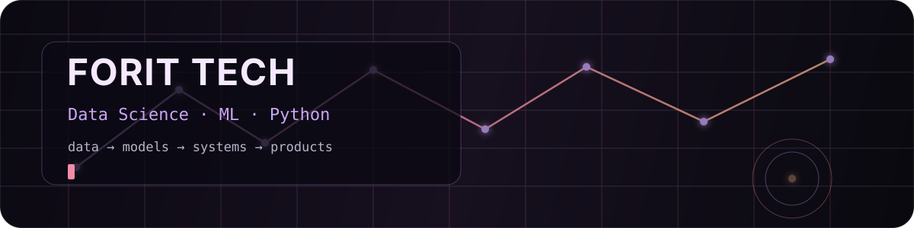

<div align="center">



<br>

[](https://github.com/forit-tech)
[](https://github.com/forit-tech)
[](https://github.com/forit-tech)
[](https://github.com/forit-tech)
[](https://github.com/forit-tech)

</div>

## Обо мне

Я работаю с **Data Science и ML**: от грязных данных и исследовательского анализа до моделей, пайплайнов и интерфейсов, которыми реально можно пользоваться.

Люблю проекты, где недостаточно просто обучить модель и вывести метрику. Мне интереснее собрать весь путь целиком: **данные → анализ → логика → backend → визуализация → рабочий продукт**.

Основной язык — **Python**. Для интерфейсов использую **React / TypeScript**, для API — **FastAPI**. Работаю с SQL, ETL, ML, статистикой, графами и локальными LLM.

```python
focus = [
    "Data Science",
    "Machine Learning",
    "Data Analysis",
    "ML / Data Products",
    "Graph Analytics",
    "LLM & local inference",
]
```

<div align="center">



</div>

## Что сейчас делаю

- исследую данные и строю ML-решения, а не только ноутбуки;
- собираю end-to-end проекты с backend и интерфейсом;
- работаю с drift detection, графовой аналитикой и качеством данных;
- экспериментирую с локальными LLM и прикладными AI-системами;
- развиваю **FORIT TECH** как пространство для своих технических проектов.

## FORIT LAB

Здесь обычно живут вещи, которые мне хочется **проверить руками**, а не просто прочитать о них.

<table>
<tr>
<td width="50%" valign="top">

### Drift detection

Проверяю, где заканчивается красивая метрика и начинается реальная нестационарность данных.

`statistics` `time series` `ML` `monitoring`

</td>
<td width="50%" valign="top">

### Graph analytics

Работаю с графами связей, весами рёбер, ролями, центральностью и сценариями handover.

`graphs` `network analysis` `data products`

</td>
</tr>
<tr>
<td width="50%" valign="top">

### Local LLM

Запускаю и сравниваю локальные модели, смотрю на память, latency, качество и то, где inference реально имеет смысл.

`LLM` `GGUF` `Ollama` `local inference`

</td>
<td width="50%" valign="top">

### Applied ML systems

Люблю собирать не только модель, а всю систему вокруг неё: данные, API, проверки, интерфейс и эксплуатационный контур.

`Python` `FastAPI` `React` `ETL`

</td>
</tr>
</table>

> Не коллекционирую технологии ради списка. Если инструмент здесь появился — значит, я им что-то делала.

## Проекты

<table>
<tr>
<td width="50%" valign="top">

### [SilentShift](https://github.com/forit-tech/SilentShift)

Исследование **concept / data drift** в многомерной телеметрии.

Не просто «нашлась ли аномалия», а **изменился ли сам процесс, который порождает данные**, когда это произошло и какие признаки за это отвечают.

`Python` `scikit-learn` `scipy` `pytest`

</td>
<td width="50%" valign="top">

### [AutoDataAnalysis](https://github.com/forit-tech/AutoDataAnalysis)

Рабочее пространство для анализа табличных данных: профиль датасета, качество, ETL, SQL-просмотр и сравнение ML-моделей.

`Python` `FastAPI` `Polars` `scikit-learn` `React`

</td>
</tr>
<tr>
<td width="50%" valign="top">

### [REduQuest](https://github.com/forit-tech/REQuest-EducationPlatform)

Desktop-платформа практического обучения IT-профессиям через маршруты, комнаты и миссии.

Первый большой маршрут — **Data Scientist**.

`React` `TypeScript` `Vite` `Desktop`

</td>
<td width="50%" valign="top">

### [CompanyOwnership Analysis](https://github.com/forit-tech/CompanyOwnership-analysis)

Data product для анализа владельцев, компаний, долей и источников: от очистки исходных данных до интерактивного dashboard.

`Python` `pandas` `React` `TypeScript` `Recharts`

</td>
</tr>
</table>

## Стек

**Data / ML**

`Python` · `pandas` · `Polars` · `NumPy` · `scikit-learn` · `SciPy` · `Jupyter` · `SQL`

**Backend / Data Engineering**

`FastAPI` · `PostgreSQL` · `ClickHouse` · `ETL` · `REST API`

**Frontend**

`React` · `TypeScript` · `Vite` · `Recharts`

**Инструменты**

`Git` · `GitHub Actions` · `Linux` · `Docker` · `VS Code`

## Немного GitHub-магии

<p align="center">
  <picture>
    <source media="(prefers-color-scheme: dark)" srcset="https://raw.githubusercontent.com/forit-tech/forit-tech/output/github-snake-dark.svg">
    <source media="(prefers-color-scheme: light)" srcset="https://raw.githubusercontent.com/forit-tech/forit-tech/output/github-snake.svg">
    
  </picture>
</p>

<div align="center">

### FORIT TECH

`data first` • `measure twice` • `ship things that work`

<sub>исследую → проверяю → собираю → ломаю → чиню → выкатываю</sub>

</div>
